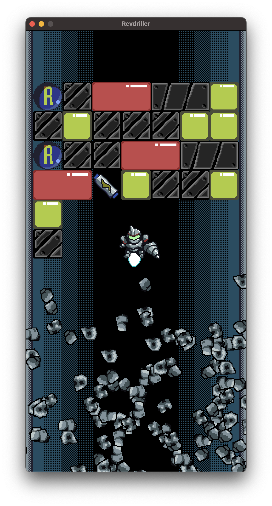

# RevDriller

[Ebiten Game Jam 2023](https://itch.io/jam/ebitengine-game-jam-2023) Entry on [Itch.io](https://yohamta.itch.io/revdriller).

-----

This is a simple action puzzle game I created for [Ebitengine Game Jam 2023](https://itch.io/jam/ebitengine-game-jam-2023). The theme is `Reverse`.​

As a player, you control a character that has a drill, and dig through the ceiling.

If you can break through all the ceilings, you win.

You can't destroy the black metal blocks, but when you get the "R" item that stands for `Reverse`, the magical power of the drill reverses which blocks can be broken and which cannot.

## Todo

- [ ] Fix bugs
- [ ] Implement touch interface for mobile
- [ ] iOS/Android application build
- [ ] Data save and loading function

## Credits

BGM: [enchanted tiki 86](https://opengameart.org/content/enchanted-tiki-86)
